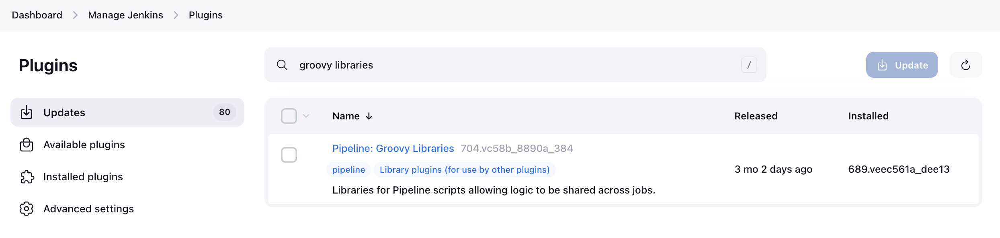
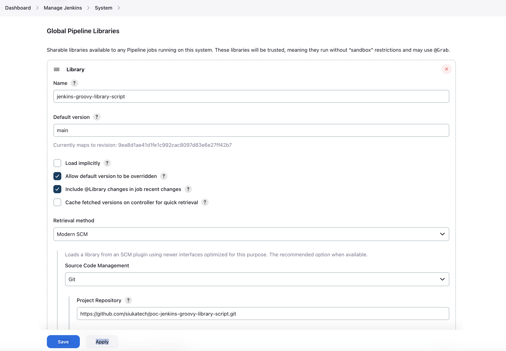
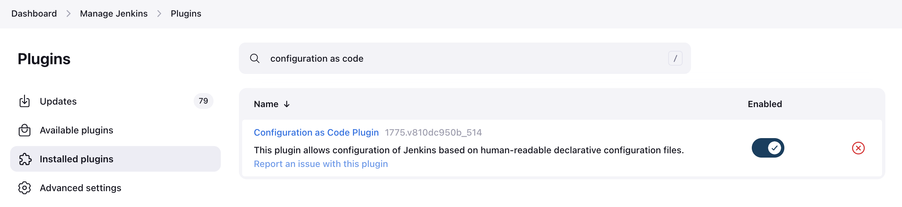
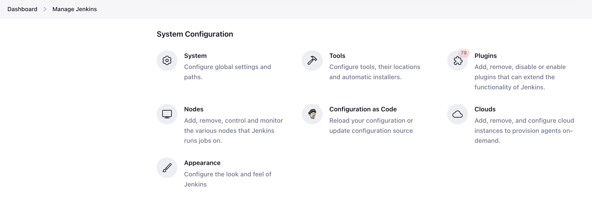

# poc-jenkins-groovy-libraries

## Global Pipeline Libraries
### Installation

### Configuration

### Tips
*** If the download of the pipeline library is incorrectly pointed to gitlab.com or github.com, then we can modify the default version to make download correctly first.  
After that, modify the incorrect `Default version` back to correct version name.  

## Configuration as Code
### Installation

### Configuration

